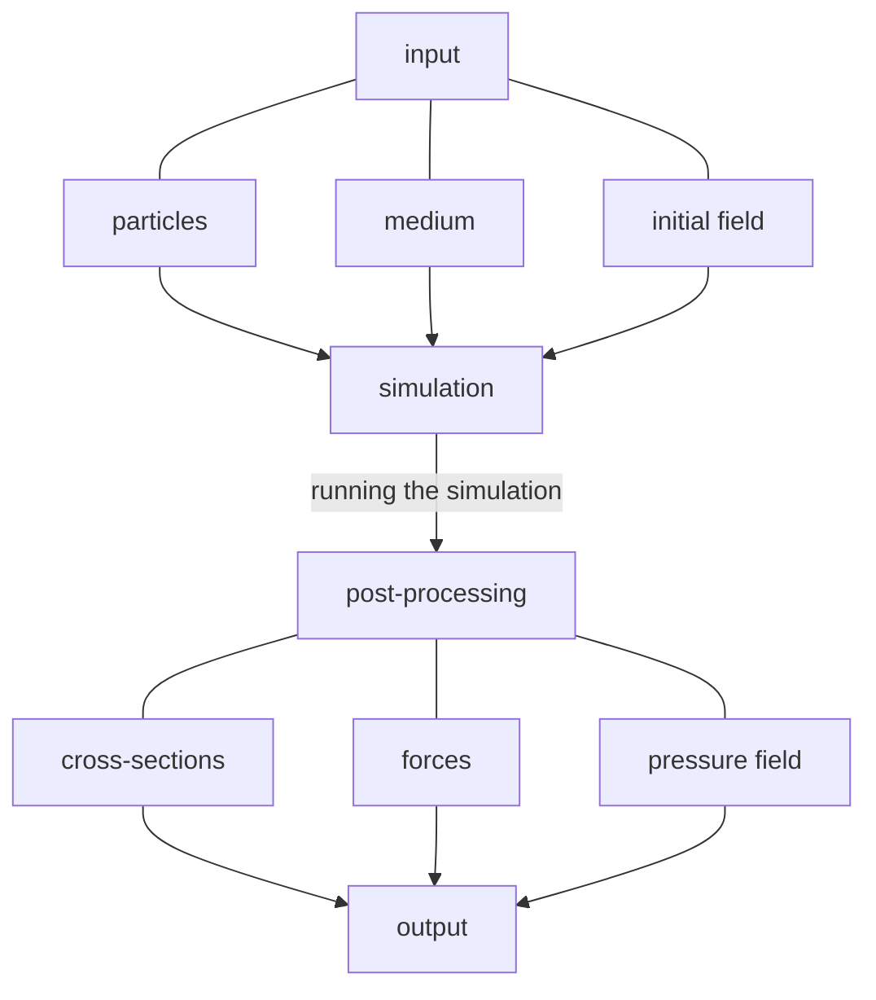

# AcSmuthi
This is the package for modelling of acoustic scattering on 
particles. It solves the Helmholtz equation with finding
the spherical waves expansion coefficients in all the system using the 
T-matrix method and calculates all the variables using these coefficients.


## Installation
Now, package is not published on pypi, but can be installed via
```commandline
pip install acsmuthi-0.1.3-py3-none-any.whl
```
This file can be downloaded from the `dist` folder of this project.

## How to use?
The main example with comments of using the package is shown in `run.py`. 

Schematically, the workflow looks like this:


## What can it do?
* Solve the problem of acoustic wave scattering on compressible particles in an inviscid medium
* Compute and render pressure near-fields
* Calculate scattering and extinction cross-sections
* Calculate forces acting on particles

## Acknowledgements
This work is supported by the Russian Science Foundation # 20-72-10141
